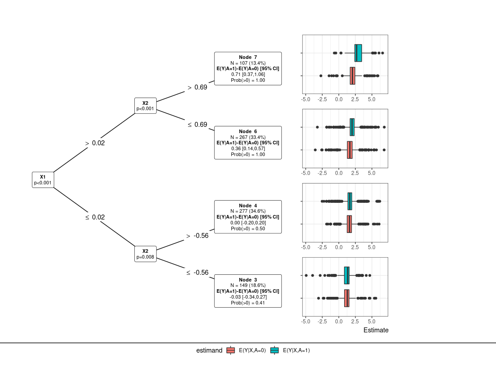
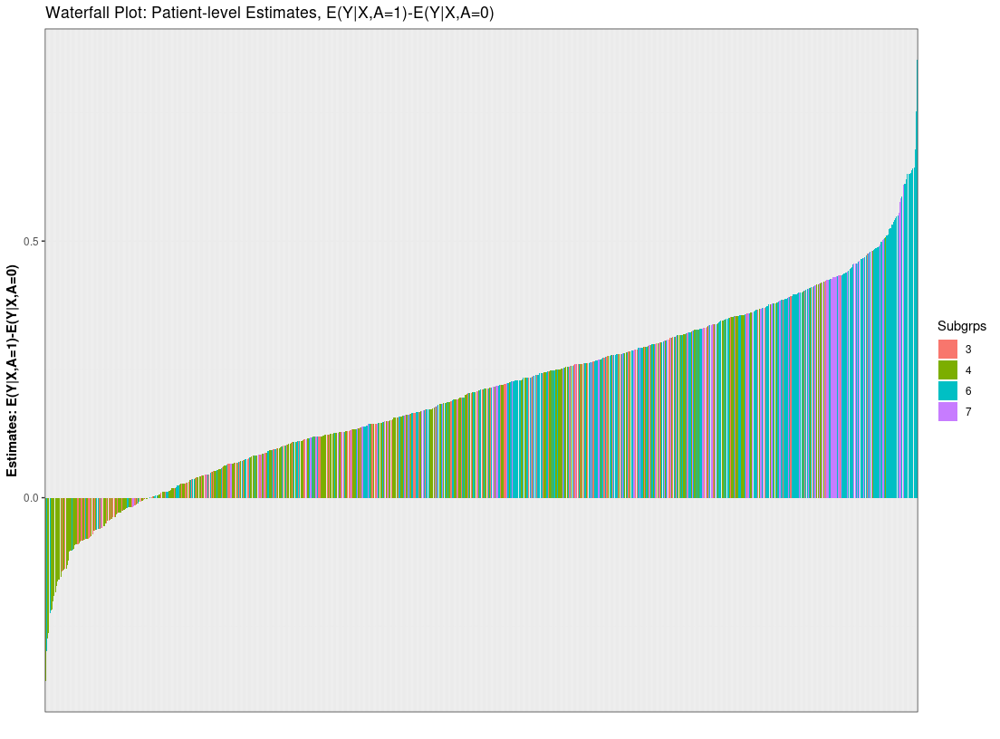
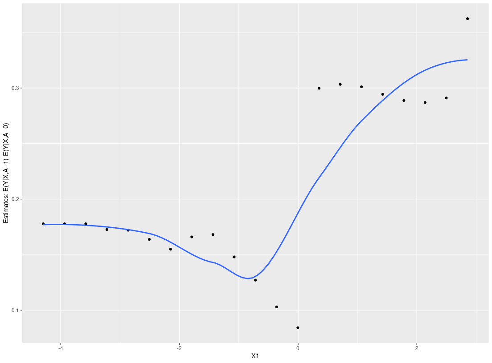
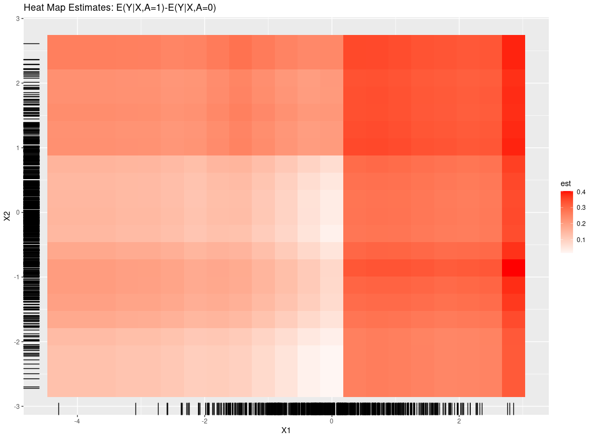

<!-- README.md is generated from README.Rmd. Please edit that file -->

# StratifiedMedicine

<!-- badges: start -->
<!-- badges: end -->

The goal of StratifiedMedicine is to develop analytic and visualization
tools to aid in stratified and personalized medicine. Stratified
medicine aims to find subsets or subgroups of patients with similar
treatment effects, for example responders vs non-responders, while
personalized medicine aims to understand treatment effects at the
individual level (does a specific individual respond to treatment A?).
Development of the package is ongoing.

Currently, the main tools in this package area: (1) Filter Models
(identify important variables and reduce input covariate space), (2)
Patient-Level Estimate Models (using regression models, estimate
counterfactual quantities, such as the conditional average treatment
effect or CATE), (3) Subgroup Models (identify groups of patients using
tree-based approaches), and (4) Parameter Estimation (across the
identified subgroups), and (5) PRISM (Patient Response Identifiers for
Stratified Medicine; combines tools 1-4). Development of this package is
ongoing.

Given a data-structure of (Y,A,X) (outcome, treatments, covariates),
PRISM is a four step feature, which comprise of individual tools
mentioned above:

1.  **Filter (filter_train)**: Reduce covariate space by removing
    variables unrelated to outcome/treatment.

2.  **Patient-level estimate (ple_train)**: Estimate counterfactual
    patient-level quantities, for example the conditional average
    treatment effect (CATE), E(Y\|X=x, A=1)-E(Y\|X=x,A=0).

3.  **Subgroup model (submod_train)**: Tree-based models to identify
    groups with heterogeneous treatment effects. Based on initial
    subgroups (ex: tree nodes), we may also pool patients into
    “benefitting” and “non-benefitting” (see “pool” argument). With or
    without pooling, subgroup-specific treatment estimates and
    variability metrics are also provided.

4.  **Resampling**: Steps 1-3 are repeated through bootstrap resampling
    for improved statistical performance of subgroup-specific estimates.

## Installation

You can install the released version of StratifiedMedicine from
[CRAN](https://CRAN.R-project.org) with:

``` r
install.packages("StratifiedMedicine")
```

And the development version from [GitHub](https://github.com/) with:

``` r
# install.packages("devtools")
devtools::install_github("thomasjemielita/StratifiedMedicine")
```

## Example: Continuous Outcome with Binary Treatment

Suppose the estimand or question of interest is the average treatment
effect, E(Y\|A=1)-E(Y\|A=0). The goal is to understand whether there is
any treatment heterogeneity across patients and if there are any
distinct subgroups with similar responses. In this example, we simulate
continuous data where roughly 30% of the patients receive no
treatment-benefit for using A=1 (study treatment) vs A=0 (control).
Responders (should receive study treatment) vs non-responders (should
receive control) are defined by the continuous predictive covariates X1
and X2 for a total of four subgroups. Subgroup treatment effects are 0
(X1 \<= 0, X2 \<= 0), 0.25 (X1 \> 0, X2 \<= 0), 0.45 (X1 \<= 0, X2 \>
0), 0.65 (X1 \> 0, X2 \>0)

``` r
library(StratifiedMedicine)
## basic example code
dat_ctns = generate_subgrp_data(family="gaussian")
Y = dat_ctns$Y
X = dat_ctns$X # 50 covariates, 46 are noise variables, X1 and X2 are truly predictive
A = dat_ctns$A # binary treatment, 1:1 randomized 

# Filter #
res_f <- filter_train(Y, A, X, filter="glmnet")
plot_importance(res_f)
```

<!-- -->

``` r
# counterfactual estimates (ple) #
res_p <- ple_train(Y, A, X, ple="ranger")
plot_dependence(res_p, X=X, vars="X1")
#> `geom_smooth()` using method = 'loess' and formula 'y ~ x'
```

<!-- -->

``` r
# subgroup model #
res_s <- submod_train(Y, A, X, submod="lmtree")
plot_tree(res_s)
```

<!-- -->

``` r
# PRISM Default: filter=glmnet, ple=ranger, submod=lmtree, param=dr #
res0 = PRISM(Y=Y, A=A, X=X, submod.hyper = list(maxdepth = 3))
#> Observed Data
#> Filtering: glmnet
#> Counterfactual Estimation: ranger (X-learner)
#> Subgroup Identification: lmtree
#> Treatment Effect Estimation: dr
plot(res0) # default: tree plot 
```

<!-- -->

``` r
plot(res0, type="PLE:waterfall")
```

<!-- -->

``` r
## Dependence Plots (univariate and heat maps)
plot_dependence(res0, vars="X1")
#> `geom_smooth()` using method = 'loess' and formula 'y ~ x'
```

<!-- -->

``` r
plot_dependence(res0, vars="X2")
#> `geom_smooth()` using method = 'loess' and formula 'y ~ x'
```

<!-- -->

``` r
plot_dependence(res0, vars=c("X1", "X2"))
```

<!-- -->

Overall, the StratifiedMedicine R package provides information at the
patient-level and the subgroup-level (if any). While there are defaults
in place, the user can also input their own functions/model wrappers
into each of the individual tools. For more details and more examples,
we refer the reader to the following vignettes, [Overview of
Package](https://CRAN.R-project.org/package=StratifiedMedicine/vignettes/SM_PRISM.html),
[User Specific
Models](https://CRAN.R-project.org/package=StratifiedMedicine/vignettes/SM_User_Models.html).
