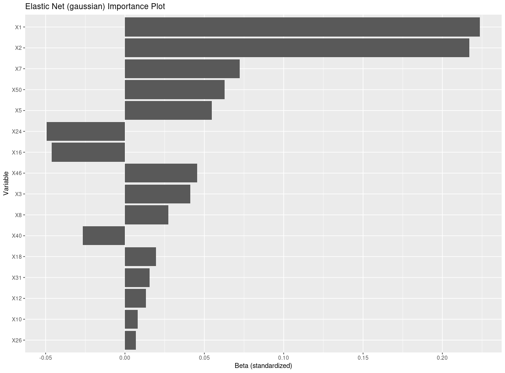

<!-- README.md is generated from README.Rmd. Please edit that file -->
StratifiedMedicine
==================

<!-- badges: start -->
<!-- badges: end -->
The goal of StratifiedMedicine is to develop analytic and visualization tools to aid in stratified and personalized medicine. Stratified medicine aims to find subsets or subgroups of patients with similar treatment effects, for example responders vs non-responders, while personalized medicine aims to understand treatment effects at the individual level (does a specific individual respond to the study treatment?). Development of this package is ongoing.

Currently, the main algorithm in this package is “PRISM” (Patient Response Identifiers for Stratified Medicine; Jemielita and Mehrotra 2019 in progress). Given a data-structure of (Y,A,X) (outcome, treatments, covariates), PRISM is a five step procedure:

1.  **Estimand**: Determine the question or estimand of interest. For example, *θ*<sub>0</sub> = *E*(*Y*|*A* = 1)−*E*(*Y*|*A* = 0), where A is a binary treatment variable. While this isn't an explicit step in the PRISM function, the question of interest guides how to set up PRISM.

2.  **Filter (filter)**: Reduce covariate space by removing variables unrelated to outcome/treatment.

3.  **Patient-level estimate (ple)**: Estimate counterfactual patient-level quantities, for example the individual treatment effect, *θ*(*x*)=*E*(*Y*|*X* = *x*, *A* = 1)−*E*(*Y*|*X* = *x*, *A* = 0).

4.  **Subgroup model (submod)**: Partition the data into subsets of patients (likely with similar treatment effects).

5.  **Parameter estimation and inference (param)**: For the overall population and discovered subgroups, output point estimates and variability metrics. These outputs are crucial for Go-No-Go decision making.

Installation
------------

You can install the released version of StratifiedMedicine from [CRAN](https://CRAN.R-project.org) with:

``` r
install.packages("StratifiedMedicine")
```

And the development version from [GitHub](https://github.com/) with:

``` r
# install.packages("devtools")
devtools::install_github("thomasjemielita/StratifiedMedicine")
```

Example: Continuous Outcome with Binary Treatment
-------------------------------------------------

Suppose the estimand or question of interest is the average treatment effect, *θ*<sub>0</sub> = *E*(*Y*|*A* = 1)−*E*(*Y*|*A* = 0). The goal is to understand whether there is any treatment heterogeneity across patients and if there are any distinct subgroups with similar responses. In this example, we simulate continuous data where roughly 30% of the patients receive no treatment-benefit for using *A* = 1 vs *A* = 0. Responders vs non-responders are defined by the continuous predictive covariates *X*<sub>1</sub> and *X*<sub>2</sub> for a total of four subgroups. Subgroup treatment effects are: *θ*<sub>1</sub> = 0 (*X*<sub>1</sub> ≤ 0, *X*<sub>2</sub> ≤ 0), *θ*<sub>2</sub> = 0.25(*X*<sub>1</sub> &gt; 0, *X*<sub>2</sub> ≤ 0), *θ*<sub>3</sub> = 0.45(*X*<sub>1</sub> ≤ 0, *X*2 &gt; 0), *θ*<sub>4</sub> = 0.65(*X*<sub>1</sub> &gt; 0, *X*<sub>2</sub> &gt; 0).

``` r
library(StratifiedMedicine)
## basic example code
dat_ctns = generate_subgrp_data(family="gaussian")
Y = dat_ctns$Y
X = dat_ctns$X # 50 covariates, 46 are noise variables, X1 and X2 are truly predictive
A = dat_ctns$A # binary treatment, 1:1 randomized 

# PRISM Default: filter_glmnet, ple_ranger, submod_lmtree, param_ple #
res0 = PRISM(Y=Y, A=A, X=X)
#> Observed Data
#> Filtering: filter_glmnet
#> PLE: ple_ranger
#> Subgroup Identification: submod_lmtree
#> Parameter Estimation: param_ple
plot(res0) # default: tree plot 
```



``` r
## Plot the distribution of PLEs ###
plot(res0, type="PLE:density") # Density plot of PLEs #
```


``` r
plot(res0, type="PLE:waterfall") # waterfall plot of PLEs
```


``` r
## Overall/subgroup specific parameter estimates/inference
res0$param.dat
#>    Subgrps   N          estimand          est         SE         LCL
#> 1        0 800          E(Y|A=0)  1.647206172 0.04818083  1.55263022
#> 2        0 800          E(Y|A=1)  1.824851581 0.05059272  1.72554124
#> 3        0 800 E(Y|A=1)-E(Y|A=0)  0.177645409 0.06401659  0.05198484
#> 4        3 149          E(Y|A=0)  1.307796853 0.11780524  1.07499927
#> 5        3 149          E(Y|A=1)  1.304127531 0.11253956  1.08173558
#> 6        3 149 E(Y|A=1)-E(Y|A=0) -0.003669322 0.15361575 -0.30723286
#> 7        4 277          E(Y|A=0)  1.595278111 0.07083816  1.45582638
#> 8        4 277          E(Y|A=1)  1.681506030 0.07991550  1.52418467
#> 9        4 277 E(Y|A=1)-E(Y|A=0)  0.086227920 0.10124699 -0.11308654
#> 10       7  99          E(Y|A=0)  1.634126348 0.14867139  1.33909281
#> 11       7  99          E(Y|A=1)  1.906350368 0.13876001  1.63098565
#> 12       7  99 E(Y|A=1)-E(Y|A=0)  0.272224021 0.19338298 -0.11153820
#> 13       8 168          E(Y|A=0)  1.777156158 0.09403446  1.59150665
#> 14       8 168          E(Y|A=1)  2.028613094 0.10191424  1.82740676
#> 15       8 168 E(Y|A=1)-E(Y|A=0)  0.251456937 0.13271402 -0.01055649
#> 16       9 107          E(Y|A=0)  2.062340441 0.14392044  1.77700417
#> 17       9 107          E(Y|A=1)  2.525732768 0.12550856  2.27689985
#> 18       9 107 E(Y|A=1)-E(Y|A=0)  0.463392328 0.18604036  0.09454922
#>          UCL          pval alpha
#> 1  1.7417821 1.526241e-158  0.05
#> 2  1.9241619 7.844199e-170  0.05
#> 3  0.3033060  5.649268e-03  0.05
#> 4  1.5405944  3.274666e-21  0.05
#> 5  1.5265195  1.669789e-22  0.05
#> 6  0.2998942  9.809754e-01  0.05
#> 7  1.7347298  1.859005e-64  0.05
#> 8  1.8388274  2.661126e-59  0.05
#> 9  0.2855424  3.951417e-01  0.05
#> 10 1.9291599  8.652905e-19  0.05
#> 11 2.1817151  1.401325e-24  0.05
#> 12 0.6559862  1.623859e-01  0.05
#> 13 1.9628057  2.470671e-43  0.05
#> 14 2.2298194  6.037915e-46  0.05
#> 15 0.5134704  5.985669e-02  0.05
#> 16 2.3476767  1.500633e-26  0.05
#> 17 2.7745657  5.416700e-38  0.05
#> 18 0.8322354  1.429656e-02  0.05
## Forest plot: Overall/subgroup specific parameter estimates (CIs)
plot(res0, type="forest")
```


``` r

## Heatmap of PLEs #
grid.data = expand.grid(X1 = seq(min(X$X1), max(X$X1), by=0.30),
                    X2 = seq(min(X$X2), max(X$X2), by=0.30))
plot(res0, type="heatmap", grid.data = grid.data)
#> $heatmap.est
```


    #> 
    #> $heatmap.prob


Overall, PRISM provides information at the patient-level, the subgroup-level (if any), and the overall population. While there are defaults in place, the user can also input their own functions/model wrappers into the PRISM algorithm. For more details and more examples, we refer the reader to the following vignettes, [PRISM\_vignette](https://CRAN.R-project.org/package=StratifiedMedicine/vignettes/SM_PRISM.html), [User\_Specific\_Models](https://CRAN.R-project.org/package=StratifiedMedicine/vignettes/SM_User_Models.html).
